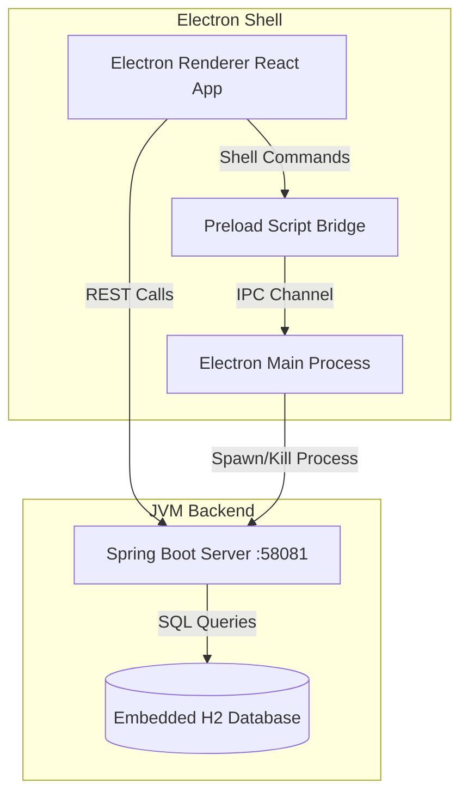

# QuickLink Dashboard

A smart link manager dashboard built with React, Spring Boot, and Electron to organize, search, and access frequently used websites with click tracking, categories, favorites, and recent usage ranking.

---

## 🛠️ Technology Stack

The application is structured as a local-first desktop software combining a modern web frontend with a robust JVM backend:

### 1. Frontend
- **React 19**: Modern declarative UI library.
- **Vite 8**: Next-generation, fast frontend build tool.
- **Vanilla CSS**: Curated, modern custom design system utilizing CSS variables for styling, responsive grid/flexbox layouts, glassmorphic panels, and native dark/light theme switching.

### 2. Desktop Wrapper
- **Electron 42**: Desktop framework wrapping the frontend and backend into a single installer.
- **Preload Scripts & IPC (Inter-Process Communication)**: Safely bridges the React browser renderer and native Node.js process (e.g., executing system calls to open links in the default external browser).

### 3. Backend
- **Spring Boot 3.5**: Production-ready enterprise framework for the business logic and REST APIs.
- **Spring Data JPA & Hibernate**: Object-relational mapping for databases.
- **Gradle**: Build automation and dependency management tool.

### 4. Database
- **H2 Database (Embedded Mode)**: File-based relational database stored in the user's home folder (`~/.quicklink-dashboard/data/`). Zero-setup database that operates offline.

---

## 🏛️ Architectural Design

The app follows a **local-first hybrid desktop architecture** combining client-server separation with a native shell wrapper.



### Process Lifecycle Flow
1. **Startup**: Electron launches and displays a lightweight, animated native HTML splash screen while spawning the Spring Boot process using `child_process.spawn`.
2. **Health Probe**: Electron polls the Spring Boot server (`/api/links/categories`) until it is healthy and responsive.
3. **Application Load**: Once the backend is ready, the main window switches from the splash screen to load the React compiled assets (`dist/index.html`).
4. **Shutdown**: When the window is closed, Electron triggers a lifecycle hook to kill the spawned Spring Boot process (`backendProcess.kill()`), ensuring no orphan Java processes remain.

---

## 📐 System Design & LLD (Low-Level Design) Patterns

### 1. Layered Architecture Pattern (Three-Tier Backend)
The backend follows a classic layered pattern to isolate concerns:
- **Presentation Layer (`LinkController`)**: Handles REST requests, parses parameters, and returns response models.
- **Business Logic Layer (`LinkService`)**: Performs validation, runs the scoring algorithms, coordinates updates, and seeds data.
- **Data Access Layer (`LinkRepository`)**: Extends `JpaRepository` to perform CRUD and custom query operations on H2.

### 2. Bridge / IPC Pattern (Electron Security)
Rather than exposing full Node.js capabilities directly to the React frontend (which introduces cross-site scripting vulnerabilities), the app implements the **Bridge Pattern** via `preload.js`:
- The renderer script communicates with an API called `window.quicklink.openExternalUrl`.
- The preload script acts as an abstraction layer, passing messages securely to the Main process over IPC using `ipcRenderer.invoke`.

### 3. Strategy & Dynamic Comparator Pattern
To support dynamic sorting of bookmarks (`smart`, `recent`, `most-clicked`, `alphabetical`), `LinkService.getLinks()` uses the **Strategy Pattern**:
- Comparators are dynamically resolved at runtime using a Java switch expression depending on user preferences.
- Default sorting uses a custom **Smart Scoring Algorithm** strategy:
  $$\text{Smart Score} = \text{Clicks} + (\text{Favorite} \times 40) + \text{Recency Bonus}$$
  *(Recency Bonus adds 160 points if opened today, 120 if yesterday, 80 if within 4 days, and 40 if within a week).*

### 4. Memento Pattern (UI State Persistence)
To provide a cohesive user experience across restarts:
- User selections (active search term, category filters, sort criteria, and themes) are saved in browser `localStorage`.
- Form drafts in progress are also saved as drafts. If the user accidentally closes the app while typing a link editor form, the state is reloaded from `localStorage` on the next launch.

### 5. Responsive API Gateway / Proxy Pattern
To simplify integration between dev and production:
- In development, Vite uses a **Proxy Configuration** to forward requests from the UI port `55173` to Spring Boot on `58081`.
- In production, where files are loaded via the `file://` protocol, the API base URL is dynamically routed directly to `http://127.0.0.1:58081` using a protocol-detection handler in `frontend/src/utils/api.js`.

### 6. React Performance Optimization Patterns
- **Deferred Render Input (`useDeferredValue`)**: The search text field utilizes React 19's `useDeferredValue`. It defers updating the link list during active typing, prioritizing smooth keyboard input rendering and preventing UI jank.

---

## 🚀 Run Locally

### Prerequisites
- Node.js (v20+ recommended)
- Java JDK 21

### Backend Setup
```powershell
cd backend
.\gradlew.bat bootRun
```

### Frontend Setup
```powershell
cd frontend
npm install
npm run dev
```
The dev server runs on `http://localhost:55173`.

### Desktop Build & Run
```powershell
# Build frontend, compile backend jar, bundle Java runtime, and run Electron locally:
npm run desktop

# Package into a production ready desktop installer (.exe):
npm run dist
```
The output executable will be placed in the `release/` directory.

---

## 📂 Local Storage Path
Data is stored locally on the client's machine:
- **Windows**: `C:\Users\<username>\.quicklink-dashboard\data\quicklink-dashboard.mv.db`
- **Unix**: `~/.quicklink-dashboard/data/quicklink-dashboard.mv.db`
